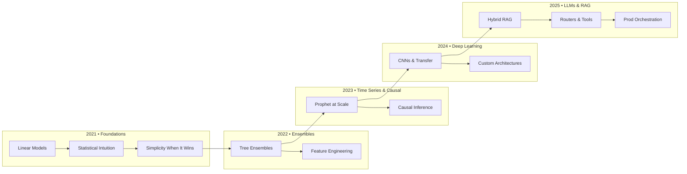
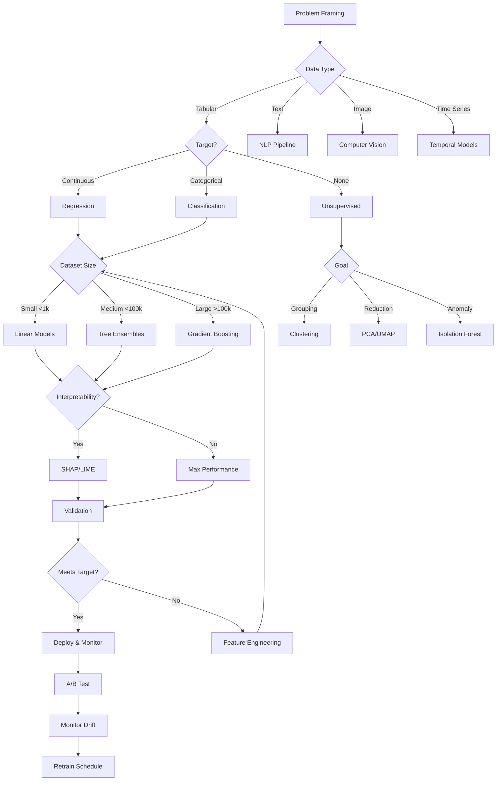
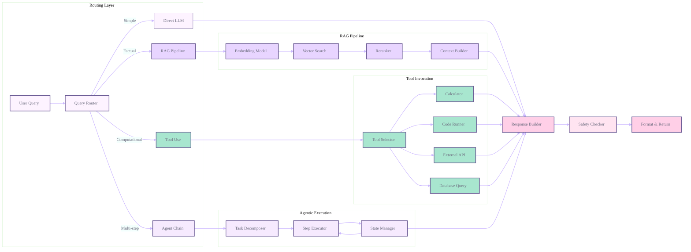

<h1 align="center">MATHEMATICS AND STATISTICS FOR DATA SCIENCE</h1>

## Relational Diagrams

### Learning Journey

### Model Selection Flow 

### RAG + Router Hybrid Pipeline

---
 

 What we Learn....! 

---

<b style="color: #8B7D8B;">Phase I: Fundamentals of Mathematics (Click to expand)</b>

<table style="width: 100%; background: linear-gradient(180deg, #FFE4E1 0%, #FFF0F5 100%); border-radius: 15px; padding: 20px;">
<tr>
<td width="5%" align="center" style="color: #8B7D8B; font-weight: bold;">01</td>
<td width="25%"><b style="color: #706B70;">Basic Algebra</b></td>
<td style="color: #4A4A4A;">

Variables, equations, functions, inequalities, and graphing fundamentals. Essential for understanding mathematical expressions and problem-solving.
</td>
</tr>
<tr style="background: rgba(237, 229, 255, 0.2);">
<td align="center" style="color: #8B7D8B; font-weight: bold;">02</td>
<td><b style="color: #706B70;">Linear Algebra</b></td>
<td style="color: #4A4A4A;">

Vectors, matrices, matrix operations, determinants, eigenvalues, eigenvectors, and vector spaces. Foundation for data representation and transformations.
</td>
</tr>
<tr>
<td align="center" style="color: #8B7D8B; font-weight: bold;">03</td>
<td><b style="color: #706B70;">Calculus</b></td>
<td style="color: #4A4A4A;">

Limits, derivatives, integrals, partial derivatives, gradients, and optimization basics. Crucial for understanding model training and optimization.
</td>
</tr>
<tr style="background: rgba(237, 229, 255, 0.2);">
<td align="center" style="color: #8B7D8B; font-weight: bold;">04</td>
<td><b style="color: #706B70;">Discrete Mathematics</b></td>
<td style="color: #4A4A4A;">

Set theory, logic, combinatorics, and probability basics. Useful for algorithmic thinking and probability foundations.
</td>
</tr>
</table>

<b style="color: #8B7D8B;">Phase II: Core Probability Theory (Click to expand)</b>

<table style="width: 100%; background: linear-gradient(180deg, #E0F7FA 0%, #E0F2F1 100%); border-radius: 15px; padding: 20px;">
<tr>
<td width="5%" align="center" style="color: #00796B; font-weight: bold;">01</td>
<td width="25%"><b style="color: #004D40;">Probability Basics</b></td>
<td style="color: #004D40;">

Sample spaces, events, axioms of probability, conditional probability, and Bayes’ theorem. The foundation of uncertainty modeling.
</td>
</tr>
<tr style="background: rgba(224, 247, 250, 0.2);">
<td align="center" style="color: #00796B; font-weight: bold;">02</td>
<td><b style="color: #004D40;">Random Variables</b></td>
<td style="color: #004D40;">

Discrete and continuous random variables, PMF, PDF, CDF. Understanding distributions and their properties.
</td>
</tr>
<tr>
<td align="center" style="color: #00796B; font-weight: bold;">03</td>
<td><b style="color: #004D40;">Common Distributions</b></td>
<td style="color: #004D40;">

Binomial, Poisson, Uniform, Normal, Exponential, and others. Key distributions used in modeling data.
</td>
</tr>
<tr style="background: rgba(224, 247, 250, 0.2);">
<td align="center" style="color: #00796B; font-weight: bold;">04</td>
<td><b style="color: #004D40;">Expectation & Variance</b></td>
<td style="color: #004D40;">

Mean, variance, standard deviation, moments, and moment generating functions. Measures of central tendency and spread.
</td>
</tr>
</table>

<b style="color: #8B7D8B;">Phase III: Statistics Essentials (Click to expand)</b>

<table style="width: 100%; background: linear-gradient(180deg, #FFF8E1 0%, #FFFDE7 100%); border-radius: 15px; padding: 20px;">
<tr>
<td width="5%" align="center" style="color: #F9A825; font-weight: bold;">01</td>
<td width="25%"><b style="color: #F57F17;">Descriptive Statistics</b></td>
<td style="color: #6D4C41;">

Measures of central tendency (mean, median, mode), dispersion (range, variance, std dev), skewness, and kurtosis.
</td>
</tr>
<tr style="background: rgba(255, 248, 225, 0.2);">
<td align="center" style="color: #F9A825; font-weight: bold;">02</td>
<td><b style="color: #F57F17;">Inferential Statistics</b></td>
<td style="color: #6D4C41;">

Sampling methods, sampling distributions, Central Limit Theorem, and making inferences about populations.
</td>
</tr>
<tr>
<td align="center" style="color: #F9A825; font-weight: bold;">03</td>
<td><b style="color: #F57F17;">Estimation & Hypothesis Testing</b></td>
<td style="color: #6D4C41;">

Point estimation, confidence intervals, null and alternative hypotheses, Type I & II errors, p-values, t-tests, chi-square tests, ANOVA.
</td>
</tr>
<tr style="background: rgba(255, 248, 225, 0.2);">
<td align="center" style="color: #F9A825; font-weight: bold;">04</td>
<td><b style="color: #F57F17;">Correlation & Regression</b></td>
<td style="color: #6D4C41;">

Pearson and Spearman correlation, simple and multiple linear regression, assumptions, and diagnostics.
</td>
</tr>
</table>

<b style="color: #8B7D8B;">Phase IV: Advanced Topics (Click to expand)</b>

<table style="width: 100%; background: linear-gradient(180deg, #E8F5E9 0%, #F1F8E9 100%); border-radius: 15px; padding: 20px;">
<tr>
<td width="5%" align="center" style="color: #388E3C; font-weight: bold;">01</td>
<td width="25%"><b style="color: #2E7D32;">Multivariate Statistics</b></td>
<td style="color: #2E7D32;">
Multivariate normal distribution, principal component analysis (PCA), factor analysis — techniques for high-dimensional data.
</td>
</tr>
<tr style="background: rgba(232, 245, 233, 0.2);">
<td align="center" style="color: #388E3C; font-weight: bold;">02</td>
<td><b style="color: #2E7D32;">Bayesian Statistics</b></td>
<td style="color: #2E7D32;">
Prior, likelihood, posterior, Bayesian inference, conjugate priors — probabilistic modeling with prior knowledge.
</td>
</tr>
<tr>
<td align="center" style="color: #388E3C; font-weight: bold;">03</td>
<td><b style="color: #2E7D32;">Time Series Analysis</b></td>
<td style="color: #2E7D32;">
Stationarity, autocorrelation, ARIMA models — analyzing data indexed in time order.
</td>
</tr>
<tr style="background: rgba(232, 245, 233, 0.2);">
<td align="center" style="color: #388E3C; font-weight: bold;">04</td>
<td><b style="color: #2E7D32;">Statistical Learning</b></td>
<td style="color: #2E7D32;">
Bias-variance tradeoff, overfitting, underfitting, cross-validation — foundational concepts in model evaluation.
</td>
</tr>
</table>

<b style="color: #8B7D8B;">Phase V: Mathematics for Machine Learning (Click to expand)</b>

<table style="width: 100%; background: linear-gradient(180deg, #E3F2FD 0%, #E1F5FE 100%); border-radius: 15px; padding: 20px;">
<tr>
<td width="5%" align="center" style="color: #1976D2; font-weight: bold;">01</td>
<td width="25%"><b style="color: #1565C0;">Optimization</b></td>
<td style="color: #1565C0;">
Gradient descent, convex functions, Lagrange multipliers — techniques to minimize loss functions.
</td>
</tr>
<tr style="background: rgba(227, 242, 253, 0.2);">
<td align="center" style="color: #1976D2; font-weight: bold;">02</td>
<td><b style="color: #1565C0;">Probability in ML</b></td>
<td style="color: #1565C0;">
Markov chains, hidden Markov models — probabilistic models for sequential data.
</td>
</tr>
<tr>
<td align="center" style="color: #1976D2; font-weight: bold;">03</td>
<td><b style="color: #1565C0;">Information Theory</b></td>
<td style="color: #1565C0;">
Entropy, mutual information, KL divergence — measuring information and uncertainty in data.
</td>
</tr>
</table>

<b style="color: #8B7D8B;">Phase VI: Practical Tools & Applications (Click to expand)</b>

<table style="width: 100%; background: linear-gradient(180deg, #FFF3E0 0%, #FFF8E1 100%); border-radius: 15px; padding: 20px;">
<tr>
<td width="5%" align="center" style="color: #EF6C00; font-weight: bold;">01</td>
<td width="25%"><b style="color: #EF6C00;">Programming Tools</b></td>
<td style="color: #6D4C41;">
Python libraries: NumPy, SciPy, pandas, statsmodels, scikit-learn; R packages: ggplot2, dplyr, caret.
</td>
</tr>
<tr style="background: rgba(255, 243, 224, 0.2);">
<td align="center" style="color: #EF6C00; font-weight: bold;">02</td>
<td><b style="color: #EF6C00;">Projects & Practice</b></td>
<td style="color: #6D4C41;">
Implement statistical analyses, hypothesis testing, regression models, and probabilistic models on real datasets.
</td>
</tr>
<tr>
<td align="center" style="color: #EF6C00; font-weight: bold;">03</td>
<td><b style="color: #EF6C00;">Documentation & Notes</b></td>
<td style="color: #6D4C41;">
Maintain notes, formula sheets, solved problems, and code snippets for quick future reference.
</td>
</tr>
</table>

<b style="color: #8B7D8B;">Phase VII: Deepening Theoretical Understanding (Click to expand)</b>

<table style="width: 100%; background: linear-gradient(180deg, #F3E5F5 0%, #FCE4EC 100%); border-radius: 15px; padding: 20px;">
<tr>
<td width="5%" align="center" style="color: #6A1B9A; font-weight: bold;">01</td>
<td width="25%"><b style="color: #4A148C;">Sampling Theory & Non-parametric Methods</b></td>
<td style="color: #4A148C;">
Understanding sampling distributions, law of large numbers, and Central Limit Theorem. Explore non-parametric tests like Wilcoxon, Sign test, and Kruskal-Wallis for data without strict assumptions.
</td>
</tr>
<tr style="background: rgba(243, 229, 245, 0.2);">
<td align="center" style="color: #6A1B9A; font-weight: bold;">02</td>
<td><b style="color: #4A148C;">Experimental Design & Multicollinearity</b></td>
<td style="color: #4A148C;">
Learn principles of randomization, blocking, factorial designs. Detect and handle multicollinearity in regression models to improve model stability and interpretation.
</td>
</tr>
<tr>
<td align="center" style="color: #6A1B9A; font-weight: bold;">03</td>
<td><b style="color: #4A148C;">Dimensionality Reduction & Advanced Linear Algebra</b></td>
<td style="color: #4A148C;">
Study techniques like Principal Component Analysis (PCA), Singular Value Decomposition (SVD), and spectral theory to reduce data complexity and extract meaningful features.
</td>
</tr>
<tr style="background: rgba(243, 229, 245, 0.2);">
<td align="center" style="color: #6A1B9A; font-weight: bold;">04</td>
<td><b style="color: #4A148C;">Vector Calculus & Convex Optimization</b></td>
<td style="color: #4A148C;">
Explore gradients, Jacobians, Hessians, and chain rule in multivariate calculus. Understand convex sets, convex functions, and optimization techniques critical for machine learning.
</td>
</tr>
</table>

<b style="color: #8B7D8B;">Phase VIII: Stochastic Processes & Numerical Methods (Click to expand)</b>

<table style="width: 100%; background: linear-gradient(180deg, #E0F7FA 0%, #B2EBF2 100%); border-radius: 15px; padding: 20px;">
<tr>
<td width="5%" align="center" style="color: #00796B; font-weight: bold;">01</td>
<td width="25%"><b style="color: #004D40;">Advanced Probability Functions</b></td>
<td style="color: #004D40;">
Moment generating functions and characteristic functions for understanding distributions and convergence properties.
</td>
</tr>
<tr style="background: rgba(224, 247, 250, 0.2);">
<td align="center" style="color: #00796B; font-weight: bold;">02</td>
<td><b style="color: #004D40;">Stochastic Processes</b></td>
<td style="color: #004D40;">
Study Poisson processes, Markov chains, and Brownian motion to model random processes evolving over time.
</td>
</tr>
<tr>
<td align="center" style="color: #00796B; font-weight: bold;">03</td>
<td><b style="color: #004D40;">Monte Carlo & Numerical Optimization</b></td>
<td style="color: #004D40;">
Learn Monte Carlo simulation techniques for probabilistic modeling and numerical methods for optimization problems without closed-form solutions.
</td>
</tr>
</table>

<b style="color: #8B7D8B;">Phase IX: Statistical Modeling & Inference (Click to expand)</b>

<table style="width: 100%; background: linear-gradient(180deg, #FFF3E0 0%, #FFE0B2 100%); border-radius: 15px; padding: 20px;">
<tr>
<td width="5%" align="center" style="color: #EF6C00; font-weight: bold;">01</td>
<td width="25%"><b style="color: #E65100;">Generalized Linear Models (GLM)</b></td>
<td style="color: #E65100;">
Logistic regression, Poisson regression, and other GLMs with link functions to model various types of response variables.
</td>
</tr>
<tr style="background: rgba(255, 243, 224, 0.2);">
<td align="center" style="color: #EF6C00; font-weight: bold;">02</td>
<td><b style="color: #E65100;">Survival Analysis & Mixed Models</b></td>
<td style="color: #E65100;">
Techniques for time-to-event data analysis and hierarchical/mixed effects models for data with nested or grouped structure.
</td>
</tr>
<tr>
<td align="center" style="color: #EF6C00; font-weight: bold;">03</td>
<td><b style="color: #E65100;">Bootstrap & Resampling</b></td>
<td style="color: #E65100;">
Non-parametric methods for estimating sampling distributions, confidence intervals, and hypothesis testing without strict parametric assumptions.
</td>
</tr>
</table>

<b style="color: #8B7D8B;">Phase X: Mathematics for AI & Deep Learning (Click to expand)</b>

<table style="width: 100%; background: linear-gradient(180deg, #E3F2FD 0%, #BBDEFB 100%); border-radius: 15px; padding: 20px;">
<tr>
<td width="5%" align="center" style="color: #1976D2; font-weight: bold;">01</td>
<td width="25%"><b style="color: #0D47A1;">Information Theory</b></td>
<td style="color: #0D47A1;">
Entropy, cross-entropy, mutual information, and KL divergence for measuring uncertainty and evaluating models.
</td>
</tr>
<tr style="background: rgba(227, 242, 253, 0.2);">
<td align="center" style="color: #1976D2; font-weight: bold;">02</td>
<td><b style="color: #0D47A1;">Graph Theory</b></td>
<td style="color: #0D47A1;">
Basics of graphs, trees, adjacency matrices, and their applications in network analysis and graphical models.
</td>
</tr>
<tr>
<td align="center" style="color: #1976D2; font-weight: bold;">03</td>
<td><b style="color: #0D47A1;">Tensor Algebra</b></td>
<td style="color: #0D47A1;">
Fundamentals of tensors, tensor operations, and their role in deep learning frameworks.
</td>
</tr>
<tr style="background: rgba(227, 242, 253, 0.2);">
<td align="center" style="color: #1976D2; font-weight: bold;">04</td>
<td><b style="color: #0D47A1;">Differential Equations</b></td>
<td style="color: #0D47A1;">
Ordinary and partial differential equations relevant to modeling dynamic systems and neural network training dynamics.
</td>
</tr>
</table>

