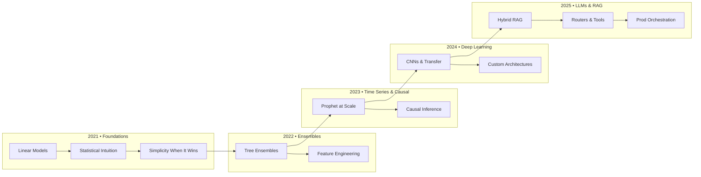
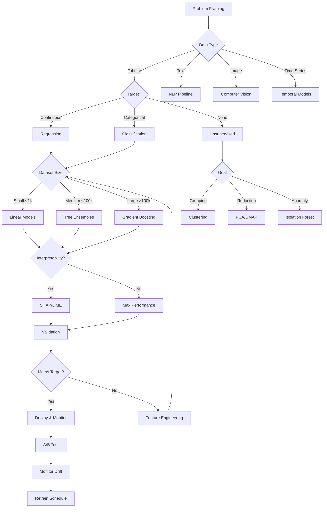
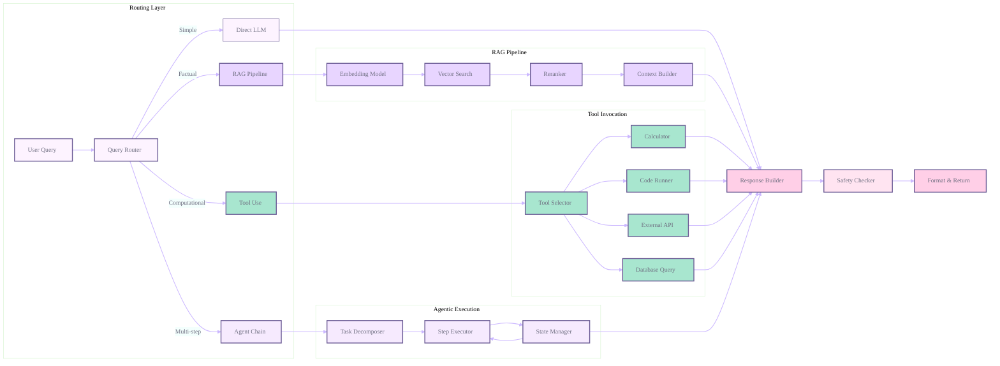

<h1 align="center">MATHEMATICS AND STATISTICS FOR DATA SCIENCE</h1>
---

## Relational Diagrams

### Learning Journey

```mermaid
flowchart LR
  subgraph Y2021 [2021 • Foundations]
    A1[Linear Models] --> A2[Statistical Intuition]
    A2 --> A3[Simplicity When It Wins]
  end
  subgraph Y2022 [2022 • Ensembles]
    B1[Tree Ensembles] --> B2[Feature Engineering]
  end
  subgraph Y2023 [2023 • Time Series & Causal]
    C1[Prophet at Scale] --> C2[Causal Inference]
  end
  subgraph Y2024 [2024 • Deep Learning]
    D1[CNNs & Transfer] --> D2[Custom Architectures]
  end
  subgraph Y2025 [2025 • LLMs & RAG]
    E1[Hybrid RAG] --> E2[Routers & Tools] --> E3[Prod Orchestration]
  end
  A3 --> B1 --> C1 --> D1 --> E1
```

### Model Selection Flow 

```mermaid
flowchart TD
    A[Problem Framing] --> B{Data Type}
    B -->|Tabular| C{Target?}
    B -->|Text| T[NLP Pipeline]
    B -->|Image| I[Computer Vision]
    B -->|Time Series| TS[Temporal Models]
    C -->|Continuous| D[Regression]
    C -->|Categorical| E[Classification]
    C -->|None| F[Unsupervised]
    D --> G{Dataset Size}
    E --> G
    G -->|Small <1k| H[Linear Models]
    G -->|Medium <100k| J[Tree Ensembles]
    G -->|Large >100k| K[Gradient Boosting]
    H --> L{Interpretability?}
    J --> L
    K --> L
    L -->|Yes| M[SHAP/LIME]
    L -->|No| N[Max Performance]
    M --> O[Validation]
    N --> O
    O --> P{Meets Target?}
    P -->|Yes| Q[Deploy & Monitor]
    P -->|No| R[Feature Engineering] --> G
    F --> S{Goal}
    S -->|Grouping| U[Clustering]
    S -->|Reduction| V[PCA/UMAP]
    S -->|Anomaly| W[Isolation Forest]
    Q --> X[A/B Test] --> Y[Monitor Drift] --> Z[Retrain Schedule]
```

### RAG + Router Hybrid Pipeline

```mermaid
%%{init: {'theme':'base', 'themeVariables': {
  'primaryColor':'#FDF3FF',
  'primaryBorderColor':'#6B5B95',
  'primaryTextColor':'#6E6E80',
  'lineColor':'#E8D5FF',
  'fontSize':'14px',
  'fontFamily':'Inter, ui-sans-serif, system-ui'
}}}%%
flowchart LR
  %% --- Subgraphs for visual separation ---
  subgraph SG_ROUTER[Routing Layer]
    UQ[User Query]:::router --> R[Query Router]:::router
    R -->|Simple| L1[Direct LLM]:::direct
    R -->|Factual| RAG[RAG Pipeline]:::rag
    R -->|Computational| TOOLS[Tool Use]:::tools
    R -->|Multi-step| AGENT[Agent Chain]:::agent
  end

  subgraph SG_RAG[RAG Pipeline]
    RAG --> EMB[Embedding Model]:::rag
    EMB --> VS[Vector Search]:::rag
    VS --> RR[Reranker]:::rag
    RR --> CTX[Context Builder]:::rag
  end

  subgraph SG_TOOLS[Tool Invocation]
    TOOLS --> SEL[Tool Selector]:::tools
    SEL --> CALC[Calculator]:::tools
    SEL --> CODE[Code Runner]:::tools
    SEL --> API[External API]:::tools
    SEL --> DB[Database Query]:::tools
  end

  subgraph SG_AGENT[Agentic Execution]
    AGENT --> DEC[Task Decomposer]:::agent
    DEC --> EXEC[Step Executor]:::agent
    EXEC --> SM[State Manager]:::agent
    SM --> EXEC
  end

  %% Response aggregation and safety
  L1 --> RESP[Response Builder]:::output
  CTX --> RESP
  CALC --> RESP
  CODE --> RESP
  API --> RESP
  DB --> RESP
  SM --> RESP

  RESP --> SAFE[Safety Checker]:::safety
  SAFE --> OUT[Format & Return]:::output

  %% --- Styles (pastel palette) ---
  classDef router fill:#FDF3FF,stroke:#6B5B95,stroke-width:2px,color:#6E6E80;
  classDef rag fill:#E8D5FF,stroke:#6B5B95,stroke-width:2px,color:#6E6E80;
  classDef tools fill:#A8E6CF,stroke:#6B5B95,stroke-width:2px,color:#6E6E80;
  classDef agent fill:#F6EAFE,stroke:#6B5B95,stroke-width:2px,color:#6E6E80;
  classDef safety fill:#FFE4F1,stroke:#6B5B95,stroke-width:2px,color:#6E6E80;
  classDef output fill:#FFCFE7,stroke:#6B5B95,stroke-width:2px,color:#6E6E80;

  %% --- Link styling for a bit more contrast ---
  linkStyle default stroke:#CBB7FF,stroke-width:1.5px

```

---

 

